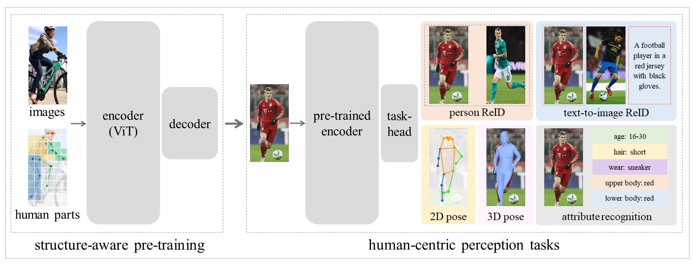
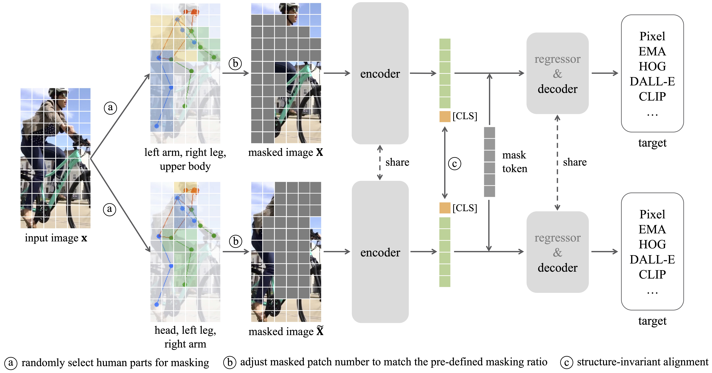
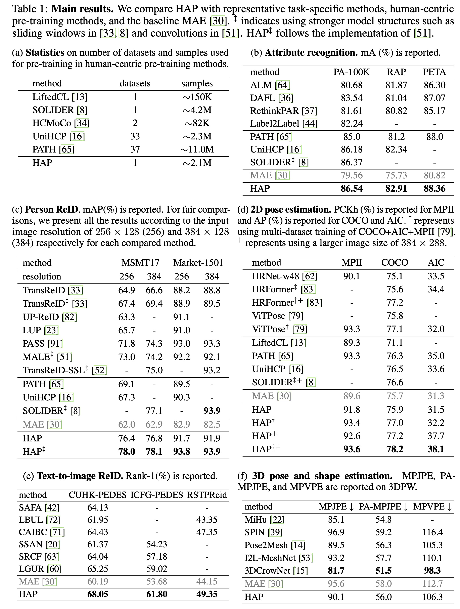

## Introduction
We present HAP, introducting human structure priors - human parts - into MIM pre-training, to yield substantial benefits across a range of human-centric perception tasks. HAP simply uses a plain ViT as the encoder yet establishes new state-of-the-art performance on 11 human-centric benchmarks, and on-par result on one dataset. For example, HAP achieves 78.1% mAP on MSMT17 for person re-identification, 86.54% mA on PA-100K for pedestrian attribute recognition, 78.2% AP on MS COCO for 2D pose estimation, and 56.0 PA-MPJPE on 3DPW for 3D pose and shape estimation.

## Framework
Our HAP is model-agnostic that can be integrated into kinds of MIM methods.

## Results
HAP simply uses a plain ViT as the encoder yet establishes new state-of-the-art performance on 11 human-centric benchmarks, and on-par result on one dataset.

## Code
<a href='https://github.com/junkunyuan/HAP'>[HAP Github]</a>

